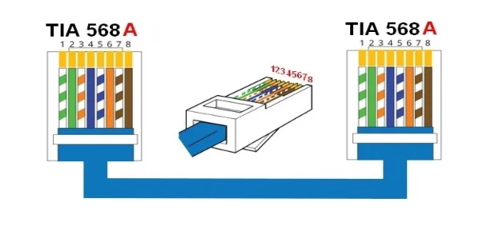

# Laboratório de Cabeamento - 1 Aula

## Objetivos:

Conhecer os padrões mais utilizados para o cabeamento de rede e a confecção de um cabo de rede. Ainda neste laboratório deverão ser configurados todos os equipamentos que compõem o kit de trabalho de cloud computing. 

Pré-requisitos:

* Ethernet . [Tanenbaum - seções 2.2.2 Par trançado, 4.3.1 Cabeamento Ethernet, 4.3.8 Ethernet de gigabit].

## Cloud Computing

O kit contém os seguintes itens:
1. Roteador TP-LINK TL-R470T+
2. Switch DLink DSG-1210-28 de 28 portas
3. 6 hosts
OBS: As senhas do roteador e switch estão no inventário do seu kit.

{width=600}

## Passo 1 – Cabo de rede (Patch cord)

O primeiro deste exercício é a confecção do cabo de rede para a conexão de seu computador pessoal ao ambiente do seu kit. O padrão que será utilizado é o ANSI/TIA/EIA 568 que foi desenvolvido em 1991 pela EIA  (Electronics Industries Alliance) e pela TIA (Telecommunications Industry Association), para normatizar as ligações elétricas/eletrônicas de cabos de rede e sua conectorização. Em 1995 uma revisão é publicada a  ANSI/TIA/EIA 568A.

{width=600}

## Passo 2 – conexão dos hosts e roteador
  

{width=600}

Conecte todos os cabos de rede presentes em seu kit no switch, hosts e roteador;
Utilize o cabo que você montou e conecte ele no switch;
Confira as configurações de endereçamento do roteador. Acesse pelo navegador o endereço 172.16.0.1. O roteador deverá estar configurado conforme as informações apresentadas na topologia;
Entre no setup do switch e também faça a sua configuração. Faça uma pesquisa na Internet em busca do manual do switch. Leia o manual e configure o IP  
