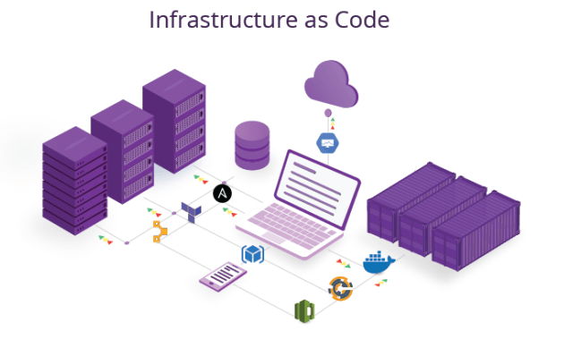

Objetivos

1. Entender os conceitos básicos Infraestrutura como código.
1. Entender os conceitos básicos sobre SLA e DR.

Pré-requisitos:

Terminar o capítulo anterior (Openstack)
Realizar a leitura [Kavis - Cap 11 e Cap 13]

??? info 
    **DIVISÃO DO ROTEIRO** 
    O Roteiro é dividido em 2 partes principais.
    Como indicado abaixo:
    - Entendendo IaC
    - Criando a Infraestrutura utilizando IaC
    - Criando um plano de Disaster Recovery e SLA

## IaC Visão geral

Infraestrutura como código (IaC) é o gerenciamento e provisionamento de infraestrutura por meio de código, em vez de processos manuais.

Utilizando o IaC, é possível criar arquivos de configuração que contenham especificações de infraestrutura, o que facilita a edição e distribuição das configurações. Também garante que você sempre forneça o mesmo ambiente. Ao codificar e documentar suas especificações de configuração, o IaC auxilia no gerenciamento de configuração e ajuda a evitar alterações de configuração não documentadas. O IaC evoluiu para lidar com a deriva ambiental em dutos de liberação. Sem o IaC, as equipes teriam que manter as configurações do ambiente de implantação separadamente. Com o tempo, cada ambiente se torna um "floco de neve", uma configuração única que não pode ser replicada automaticamente. Inconsistências entre ambientes podem causar problemas de implantação. O gerenciamento e a manutenção da infraestrutura envolvem processos manuais que são propensos a erros e difíceis de rastrear.

{width=600}

### Reforçando

O IaC evita a configuração manual e garante consistência ao expressar o estado desejado do ambiente por meio de código bem documentado em formatos como por exemplo o JSON. A implantação de infraestrutura com IaC é repetível e evita problemas de tempo de execução causados ​​por configurações quebradas ou dependências ausentes. 

**Para fazer alterações, você precisa editar a origem, não o destino**.

A idempotência (a capacidade de uma determinada operação produzir sempre o mesmo resultado) é um princípio fundamental da IaC. O comando deploy sempre define o ambiente de destino com a mesma configuração, independentemente do estado inicial do ambiente. A idempotência é alcançada configurando automaticamente os destinos existentes ou excluindo os destinos existentes e recriando novos ambientes.

## O que é Terraform em Infraestrutura como Código?

É uma das possiveis ferramentas para IaC.

O mercado de Infraestrutura como Código amadureceu ao longo dos anos. Há uma grande variedade de ferramentas, oferecendo diferentes recursos.

{width=600}

Terraform é a infraestrutura da HashiCorp como ferramenta de código. Ele permite que você defina recursos e infraestrutura em arquivos de configuração declarativos legíveis por humanos e gerencie o ciclo de vida de sua infraestrutura. O uso do Terraform tem várias vantagens em relação ao gerenciamento manual de sua infraestrutura:

1. O Terraform pode gerenciar a infraestrutura em várias plataformas de nuvem.
1. A linguagem de configuração legível por humanos ajuda você a escrever código de infraestrutura rapidamente.
1. O estado do Terraform permite rastrear alterações de recursos em todas as suas implantações.
1. Você pode confirmar suas configurações no controle de versão para colaborar com segurança na infraestrutura.

!!! Para implantar infraestrutura com o Terraform:

    * Escopo - Identifique a infraestrutura para o seu projeto.
    * Autor - Escreva a configuração para sua infraestrutura.
    * Inicializar - Instale os plugins que o Terraform precisa para gerenciar a infraestrutura.
    * Plan - Visualize as alterações que o Terraform fará para corresponder à sua configuração.
    * Aplicar - Faça as alterações planejadas.